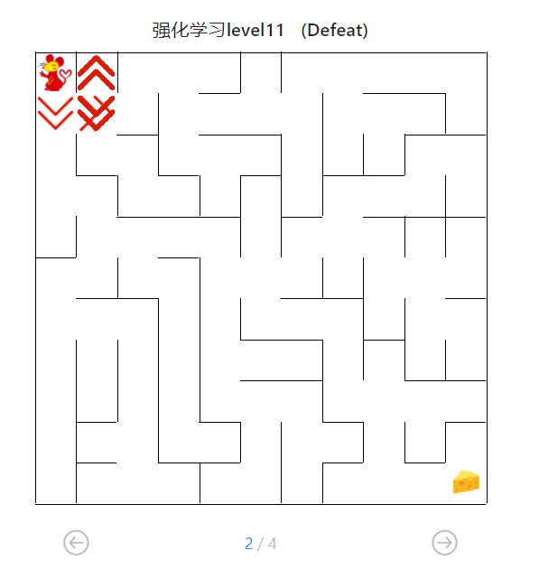
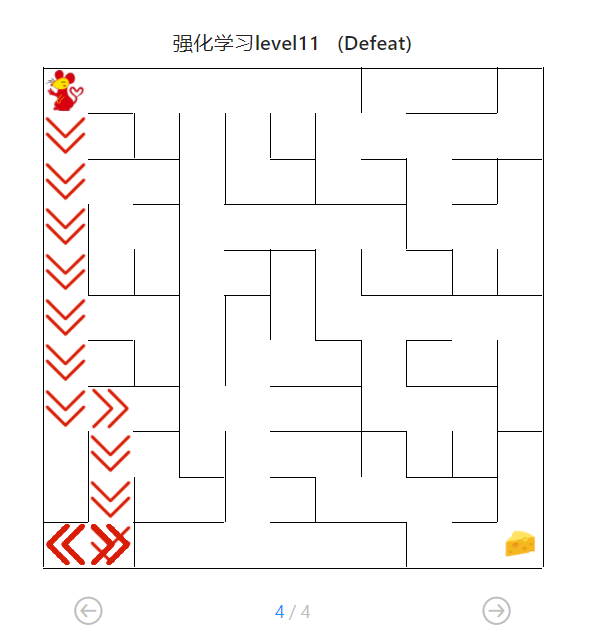
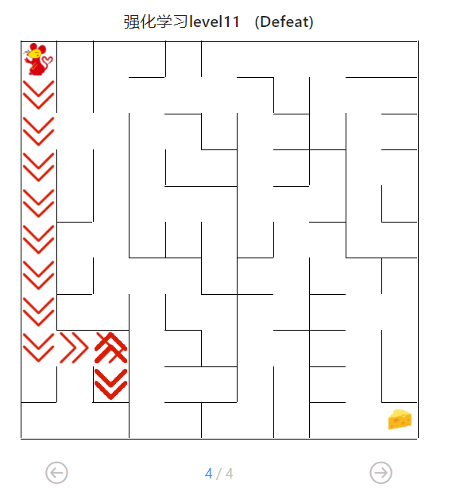

## 机器人自动走迷宫

**姓名**：胡天扬

**学号**：3190105708

**专业**：自动化（控制）

**课程**：人工智能与机器学习

**指导教师**：张建明


### 题目分析

​		本题主要考察 **搜索算法** 和 **强化学习**，需要根据 *广度优先* 来自己编写一个基础搜索算法，并实现 $DQN$ 的搜索，主要任务是读懂封装的几个类，并对参数进行调整。

### 深度遍历

​		相对来说 *深度遍历* 比 *$AStar$* 略简单一些，而且可以直接调用题目给出的 *广度遍历* 中的相关函数，而且对于一个维度不大的迷宫来说，深度遍历与$AStar$的运行效率不会有很大差别，但在编程上会简单很多。

#### 伪代码

```python
根节点为起始位置，入栈
while True:
    令当前节点为栈顶元素
    
    if 当前节点位置为目标位置:
        回溯路径
        跳出循环
        
    if 已经搜索过该节点:	# 说明是死路
        弹栈		# 弹出栈顶当前节点
        直接进入下一个循环
     
    if 该节点是叶节点:
        扩展子节点
     
    if 没有子节点:	# 说明是死路
        弹栈
    else:
        将子节点加入栈顶	# 在下一个循环中继续扩展子节点
    
    标记已访问过该节点
```

#### 代码

```python
def my_search(maze):
    """
    任选深度优先搜索算法、最佳优先搜索（A*)算法实现其中一种
    :param maze: 迷宫对象
    :return :到达目标点的路径 如：["u","u","r",...]
    """
    path = []

    # -----------------请实现你的算法代码--------------------------------------
    start = maze.sense_robot()
    root = SearchTree(loc=start)
    queue = [root]
    h, w, _ = maze.maze_data.shape
    is_visit_m = np.zeros((h, w), dtype=np.int32)

    while True:                
        current_node = queue[-1]            # 当前位置为栈顶元素

        if current_node.loc == maze.destination:
            path = back_propagation(current_node)
            break

        # 如果已经搜索过，弹栈
        if is_visit_m[current_node.loc]:
            queue.pop()
            continue

        # 如果是叶节点则扩展子节点
        if current_node.is_leaf():
            expand(maze, is_visit_m, current_node)

        # 如果没有子节点，弹栈
        if not current_node.children:
            queue.pop()
        else:
            for child in current_node.children:
                queue.append(child)

        is_visit_m[current_node.loc] = 1    # 标记该位置已被搜索
    
    return path
```

### $QLearning$

#### 原理

​		下面对 $QLearning$ 的部分内容和参数进行解释，方便后续调参。

##### $Qtable$迭代公式

​                                               $$Q(s,a) = Q(s,a)+\alpha[r+\gamma max_{a'}Q(s', a')-Q(s,a)]$$

​		公式的原理不做过多解释。

#### 参数

##### epsilon greedy & $\epsilon\ (epsilon)$

​		智能体一开始接触到的 $state$ 很少，如果以很大概率按照已经学到的 $Q table$ 执行，那么很有可能无法充分探索位置的 $state$ ，导致原地绕圈。同时我们希望小车一开始能随机的走一走，接触到更多的 $state$。所以我们希望智能体在一开始的时候不完全按照 $Q table$ 的结果执行，即以一定的概率 $\epsilon$，随机选择 $action$，而不是根据 $maxQ$ 来选择 $action$。然后随着不断的学习，以衰减因子 $t$ 的速度降低 $\epsilon$ 的值，从而使得智能体愈发趋于 $Qtable$ 来执行 $action$。本质上来说，这是一个 **探索（exploration）**和 **利用（exploitation）** 的问题，需要我们在 *探索* 和 *执行* 之间作出平衡。

##### $\alpha\ (alpha)$

​		$\alpha$ 被称为 *学习率*，用于权衡上一次学到结果和这一次学习结果，即决定本次的误差有多少是要被学习的，这一点可以从公式上体现。因此 $\alpha$ 设置过低会导致智能体只在乎之前的知识，而不能积累新的 $reward$。一般 $\alpha$ 取 0.5。

##### $\gamma\ (gamma)$

​		$\gamma$ 是考虑未来 $reward$ 的衰减因子，$\gamma$ 越接近1，智能体对未来的 $reward$ 越敏感，如果 $\gamma$ 过小，终点处的正奖励不能够扩散到周围，也就是说，智能体很有可能无法学习到一个到达终点的策略。一般 $\gamma$ 取 0.9。

#### 解题过程

​		$QLearning$ 的原理不难理解，而且题目中给出了程序，但是直接运行会发现没有办法通过 *高级难度* 的迷宫。


​		观察迷宫走向的图片，可以发现，智能体在远点附近徘徊，没有很好地探索整个地图，由此推断是 $\epsilon$ 的影响。



​		首先尝试调低 $\epsilon$ 的衰减比例 ，使其每次衰减的幅度变小，这样智能体能在最初的阶段探索更多状态。将每次衰减从 $t*0.1$ 调为 $t*0.05$ 后，仍未通过测试，但探索范围更大。



​		进一步调低至 $t*0.01$，发现效果变差，连中级难度的迷宫都没有通过，于是考虑调节 $epsilon$ 的阈值，将原本的0.01提升至0.02，也就是保证了最小探索的概率。



​		智能体仍未能走通高级迷宫，但比之前效果要好。最终调整参数至$\epsilon=0.3,\alpha=0.7$ 时，可以顺利走完所有迷宫。


### $DQN$

#### 原理

​		$DQN$ 的本质是利用神经网络来近似值函数 $v(s)$，题目中给出了$MinDQNRobot$ 类，是因为到达终点的 $reward$ 改成了$-50$，相当于与原先策略完全相反。

#### 参数

​		$\alpha,\gamma$ 等参数与 $QLearning$ 中的一致，不再介绍。

##### 经验回放大小

​		智能体把对环境的感知，放入经验回放中，作为神经网络的样本集合。如果经验回放集合尺寸太小了，必然要选择丢弃部分经验，如果选择丢弃的经验是很重要的，就会给训练带来不稳定，智能体在出生点附近失败的机会陡增，造成训练的不稳定，$Q$ 值会收敛到一个不是最优的值上。因此一般来说，经验回放集合偏大比较好，如果不确定什么样的经验是可以丢弃的，就不要丢弃。

##### 神经网络结构

​		神经网络的复杂度与样本数量、经验回放的、和 $e-greedy$ 策略等都息息相关。打个比方，如果我们按照非常注重探索的想法来设置 $e-greedy$，即 $\epsilon$ 偏大，那么经验回放中的经验会更加丰富，因此需要一个更加复杂的神经网络结构。

#### 解题过程

​		题目给了三个全连接层，中间层有512个神经元，可以考虑减少层数至两层，并减少神经元的个数。

```python
self.input_hidden = nn.Sequential(
    nn.Linear(state_size, 512),
    nn.ReLU(False),
    nn.Linear(512, 512),
    nn.ReLU(False))
self.final_fc = nn.Linear(512, action_size)
```

​		炼丹过程就不赘述了，只能说调参事件非常痛苦的事情，最后也同样能顺利跑通所有迷宫。


### 心得体会

​		本题的深度遍历一开始尝试自己写个类封装一下，但是写着写着还是往题目的写法在靠近，所以最后直接调用了广度遍历中封装好的类和函数。$QLearning$ 和 $DQN$ 如果自己写的话还是挺麻烦的，但是题目全部都实现好了，所以要理解参数含义，才能有目标地调参。

